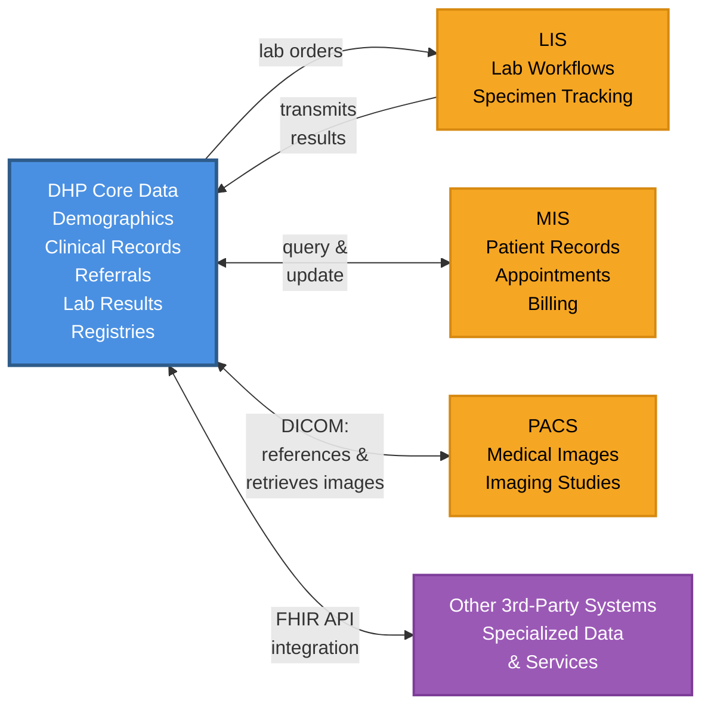
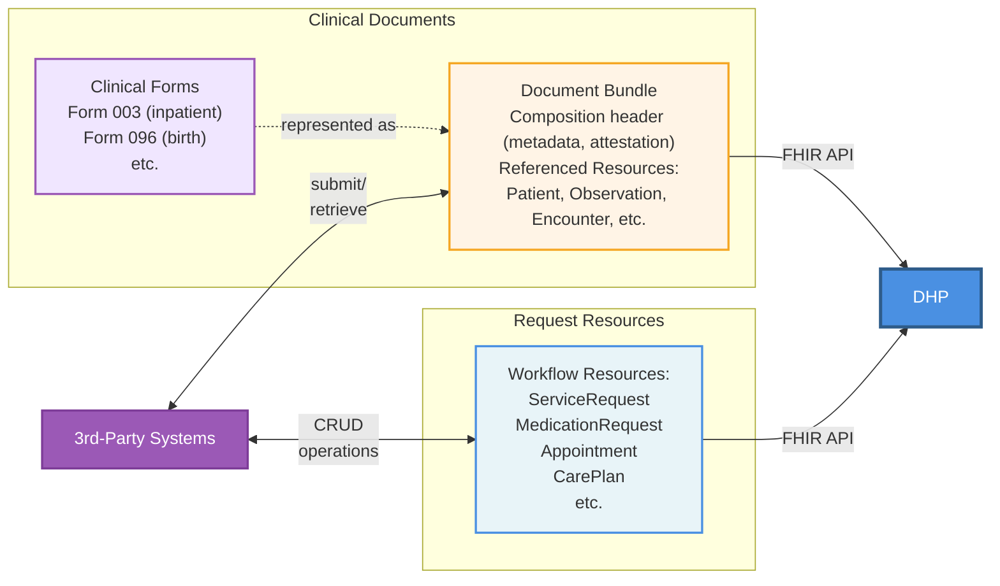
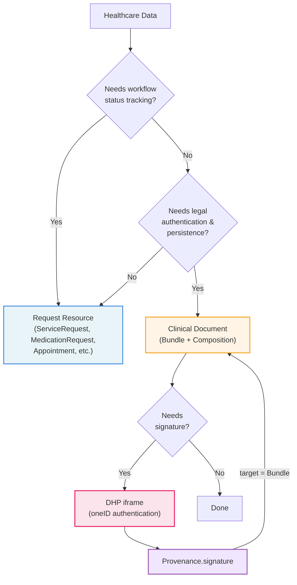

# DHP Integrations Implementation Guide

## Overview

This Implementation Guide defines FHIR R5-based integration specifications for third-party systems that integrate with the [Digital Health Platform (DHP)](https://dhp.uz/fhir/core/en/index.html). It is designed to enable external healthcare systems to exchange data with DHP while maintaining their own data sovereignty.

## Purpose

DHP Integrations IG provides:

- **Standard data structures** - FHIR profiles and extensions for external systems integrating with DHP
- **Terminology** - CodeSystems and ValueSets for standardized coding
- **API specifications** - data exchange patterns between external systems and DHP
- **Integration patterns** - support for DHP's hybrid architecture
- **Conformance requirements** - requirements for third-party system integrations

This IG is intended for implementers developing or configuring systems that need to integrate with DHP. Example systems include Medical Information Systems (MIS), Picture Archiving and Communication Systems (PACS), Laboratory Information Systems (LIS), as well as any other third-party healthcare applications that need to exchange data with DHP.

While external systems may develop their own FHIR Implementation Guides, this IG may include profiles developed collaboratively with external system vendors to streamline the integration process and reduce implementation overhead.

## Integration approach - hybrid model

DHP uses a hybrid integration approach where not all data is centralized. Instead, the platform combines centralized storage of core healthcare data with distributed, specialized data maintained by external systems.

### Data stored in DHP

DHP centrally stores and manages core healthcare data:

- **Patient demographics and master data** - master patient index and demographic information
- **Core clinical records (EHRs)** - essential electronic health record data
- **Referrals and prescriptions** - clinical orders and referral documentation
- **Laboratory results** - lab results and diagnostic reports transmitted from LIS systems
- **Master registries** - patient registry, provider directory, organization registry, and terminology services

### Data maintained by external systems

External systems maintain their own operational data while integrating via FHIR APIs. Examples include:

- **MIS systems** - patient records, appointments, billing data, and facility-specific workflows
- **PACS systems** - medical images and diagnostic imaging studies (DHP supports DICOM-based image exchange, storing references to images in PACS and retrieving images for authorized users)
- **LIS systems** - laboratory workflows, specimen tracking, and detailed test processing data
- **Other 3rd-party systems** - any healthcare application with specialized data or services that need to integrate with DHP

### Integration pattern

For most external system data, DHP can store references to data in external systems rather than duplicating everything. However, certain critical data like laboratory results are transmitted to and stored in DHP. This hybrid approach:

- Maintains data ownership with the originating system
- Enables real-time access to source data through API integration
- Preserves system-specific workflows and business logic
- Simplifies compliance with data governance requirements

DHP and external systems maintain complementary data sets and interact through FHIR and custom APIs: DHP provides authoritative master data and core clinical records, while external systems provide specialized operational data and domain-specific capabilities.

## Data exchange approaches

Integrations with DHP support two complementary methods for exchanging healthcare data:

### Request resources

For operational workflows requiring status tracking, DHP prefers [request resources](https://hl7.org/fhir/R5/workflow.html). Common examples include [ServiceRequest](https://hl7.org/fhir/R5/servicerequest.html), [MedicationRequest](https://hl7.org/fhir/R5/medicationrequest.html), [Appointment](https://hl7.org/fhir/R5/appointment.html), [CarePlan](https://hl7.org/fhir/R5/careplan.html), and [Claim](https://hl7.org/fhir/R5/claim.html). These resources support workflow state tracking (requested → accepted → in-progress → completed), making them ideal for real-time coordination.

### Clinical Documents

For data requiring legal authentication and long-term persistence (e.g., Form 003 for inpatient stays, Form 096 for births), DHP uses **Clinical Documents** - a Bundle containing a Composition header with metadata and attestation, plus referenced clinical resources (Patient, Observation, Condition, etc.).

When a signature is required, 3rd party systems will display an iframe from the DHP platform where practitioners will log in to authenticate themselves using oneID. This will generate a cryptographic signature (either as JWS Digital Signature or based on the W3C Verifiable Credentials Data Model, to be decided) that will be returned to the 3rd party system to be attached as a [Provenance.signature](https://hl7.org/fhir/R5/provenance-definitions.html#Provenance.signature). Additionally, DHP also pre-adopts [R6 signing rules](https://build.fhir.org/signatures.html#Bundles) as they significantly differ from R5 and that is the future direction where FHIR is going.

#### Choosing the right approach

## Identification of versions

Artifacts in this guide - profiles, extensions, code systems, value sets, concept maps, naming systems and the FHIR package - carry the version of the guide itself. Versioning follows [Semantic Versioning (SemVer)](https://semver.org/) in the format `MAJOR.MINOR.PATCH`, so every artifact in version `0.7.0` of the guide is also versioned `0.7.0` and it is always clear which release an artifact belongs to.

`MAJOR` and `MINOR` follow [UZ Core](https://dhp.uz/fhir/core/). A `0.7.x` release of this guide is built against UZ Core `0.7.x` and is consistent with it, which is why the first release of this guide is `0.7.0` rather than `0.1.0`. `PATCH` does not follow UZ Core: this guide can publish a patch release on its own, and a UZ Core patch release does not require one here. To see exactly which version this guide depends on, consult the dependency table below.

While an artifact is in development and not yet ready for production use, it has a status of `draft`. Once it is ready for production use it is marked `active`, and a withdrawn artifact is marked `retired`.

### Development versions: 0.x.x

- Guide status: `draft`
- Artifact status: `draft`, with the `experimental` flag set to `true`
- Used during initial development and testing
- Breaking changes may occur between minor versions

### Production versions: 1.x.x and later

- Guide status: `active`
- Artifact status: `active`, with the `experimental` flag set to `false`
- The first stable release begins at `1.0.0`
- Strict SemVer compatibility rules apply
- A new major version indicates breaking changes or significant architectural updates

The exception to all of the above are the translation supplements, which carry the version of the code system they supplement rather than the version of this guide. The SNOMED CT supplements are versioned by SNOMED CT release, for example `2026.1.0`, and the LOINC supplement by LOINC release, for example `2.82`. If a supplement has to be updated while the supplemented system is unchanged, an extra version number is added, for example `2.82.1`.

---







